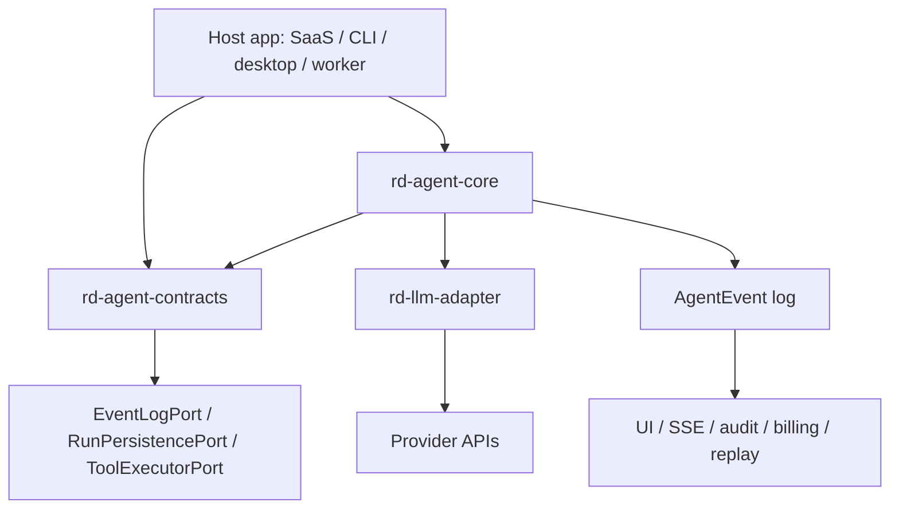

# Architecture

## System Shape

`ruidong-agent-core` is a Python monorepo with a protocol directory and a small
set of runtime packages. The architecture is intentionally layered:



The dependency direction is:

```text
rd-agent-contracts
  <- rd-agent-proto
  <- rd-llm-adapter
  <- rd-agent-core
  <- examples/reference_host
```

`rd-llm-gateway`, `rd-replay-evals`, and `rd-tools` are still maintained in the
workspace, but new host integrations should use `rd-llm-adapter` plus
`rd-agent-core`.

## Package Boundaries

| Package | Responsibility | Evidence |
| --- | --- | --- |
| `rd-agent-contracts` | Public dataclasses, host ports, ids, usage, event envelope, run lifecycle, continuation, subagent, workspace, and trace contracts | `packages/rd-agent-contracts/src/rd_agent_contracts/` |
| `rd-agent-proto` | Protobuf files, generated Python protobuf bindings, and dataclass/proto converters | `packages/rd-agent-proto/src/rd_agent_proto/`, `proto/ruidong/agent/v1/` |
| `rd-llm-adapter` | Provider request builders, stream parser sessions, transports, fixture replay, adapter registry | `packages/rd-llm-adapter/src/rd_llm_adapter/` |
| `rd-agent-core` | Turn/run kernels, runner facades, model profiles, tool safety, continuation/subagent orchestration, testing harness, conformance checks | `packages/rd-agent-core/src/rd_agent_core/` |
| `rd-replay-evals` | Golden trace format and replay checks | `packages/rd-replay-evals/src/rd_replay_evals/` |
| `rd-tools` | Operational CLI helpers | `tools/src/rd_tools/` |
| `examples/reference_host` | Executable host-port example, not a stable production schema | `examples/reference_host/` |

## Runtime Flow

1. Host builds `RunRequest` or `AgentRunnerRequest`.
2. Core asks an injected `LLMClientPort` for a standard event stream.
3. `rd-llm-adapter` converts provider chunks into standard events.
4. `TurnKernel` writes `AgentEvent` records through `EventLogPort`.
5. Complete tool calls become `ToolExecutionRequest` values.
6. Invalid or partial tool calls are logged but never executed.
7. Tool results are converted into transcript messages.
8. `RunKernel` continues until end turn, pause, cancellation, budget, timeout,
   max turns, max tools, or loop protection stops the run.
9. Host projects the append-only event log to UI, billing, audit, replay, and
   storage.

Evidence:

- `packages/rd-agent-core/src/rd_agent_core/turn.py`
- `packages/rd-agent-core/src/rd_agent_core/run.py`
- `packages/rd-agent-core/src/rd_agent_core/events.py`
- `packages/rd-agent-contracts/src/rd_agent_contracts/event_log.py`
- `packages/rd-agent-contracts/src/rd_agent_contracts/tool_execution.py`

## Event Log Invariant

`AgentEvent` is the replayable event-log unit. `EventLogPort` implementations
must allocate monotonically increasing per-run `seq` values and return the same
event when an idempotency key is replayed.

Evidence:

- `packages/rd-agent-contracts/src/rd_agent_contracts/events.py`
- `packages/rd-agent-contracts/src/rd_agent_contracts/event_log.py`
- `packages/rd-agent-core/src/rd_agent_core/conformance.py`
- `packages/rd-agent-contracts/tests/test_event_log.py`
- `examples/reference_host/sqlite_reference_host.py`

## Tool Execution Invariant

Only complete and parseable tool calls may reach `ToolExecutorPort`. Invalid
tool calls are preserved in the transcript and event log for audit and replay,
but they are never executed.

Evidence:

- `packages/rd-agent-contracts/src/rd_agent_contracts/enums.py`
- `packages/rd-agent-contracts/src/rd_agent_contracts/transcript_blocks.py`
- `packages/rd-agent-core/src/rd_agent_core/turn.py`
- `packages/rd-agent-core/tests/test_tool_safety.py`
- `packages/rd-agent-core/tests/test_turn_kernel.py`

## Host-Neutral Boundary

The runtime cannot depend on product infrastructure. The boundary is enforced by
architecture tests and by public integration docs.

Evidence:

- `packages/rd-agent-core/tests/test_architecture_boundaries.py`
- `docs/HOST-INTEGRATION-CONTRACT.md`
- `docs/API-STABILITY.md`

## Verification Strategy

Architecture claims are verified through:

- `uv run ruff check .`
- `uv run pytest -q`
- `uv run python tools/scripts/verify_governance.py`
- `uv run python tools/scripts/verify_protocol.py`
- `uv run pytest -q packages/rd-replay-evals/tests/test_golden_traces_self_consistent.py`
- `uv run pytest -q examples/reference_host/tests`
- `uv run python -m compileall -q packages tools examples`

The combined command is:

```bash
uv run python tools/scripts/release_gate.py
```
