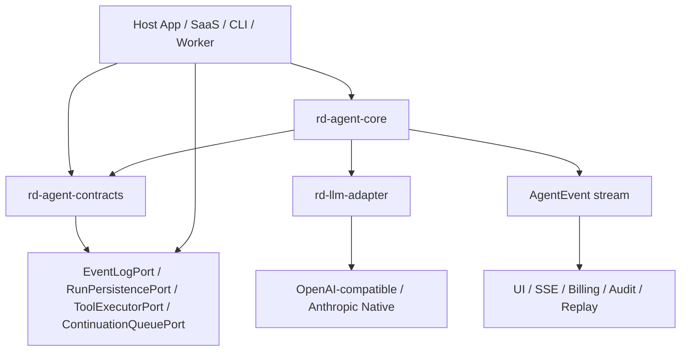

# Agent Runtime SDK Overview

`ruidong-agent-core` 是一个 **Python Agent Runtime SDK / 底座库**，不是一个完整 SaaS、不是一个 Web 服务，也不是只面向某个产品的业务框架。

它提供的是 agent 运行时的稳定内核：把模型流式输出、工具调用、事件日志、run 生命周期、预算边界、continuation/subagent 等能力抽成 host-neutral 的 SDK。上层产品可以是 SaaS、CLI、本地桌面、队列 worker 或未来 PaaS 服务；它们通过 `rd-agent-contracts` 的 ports 注入数据库、队列、权限、工具、计费和 UI 投影。

## 一句话定位

这是一个可嵌入到任意 Python host 的 Agent Runtime SDK：

- `rd-agent-contracts` 定义跨包协议、数据结构和 host ports；
- `rd-llm-adapter` 把不同 provider 的流式 chunk 归一成标准事件；
- `rd-agent-core` 执行 turn/run kernel、AgentRunner lifecycle facade、provider LLM client glue、工具调用、事件写入、取消、运行摘要/观测和运行策略；
- `rd_agent_core.testing` 提供接入方可复用的本地 harness。

## 架构分层



## SDK 负责什么

### 1. 标准化模型流事件

`rd-llm-adapter` 把 OpenAI-compatible 和 Anthropic Native 的流式响应归一为统一的 `StandardEvent`：

- `TextDelta`
- `ReasoningDelta`
- `ToolCallStart`
- `ToolCallIdDelta`
- `ToolCallNameDelta`
- `ToolCallArgsDelta`
- `ToolCallEnd`
- `UsageUpdate`
- `TurnDone`

这样 core 不需要理解 provider 私有 chunk，也不会把 provider 细节泄漏到业务层。

### 2. Turn kernel

`TurnKernel` 消费一个 turn 内的标准事件，完成：

- 写入 `turn_started`、text/reasoning delta、tool call lifecycle、usage、turn completed 等事件；
- 收敛 `TurnDone.content` 作为 transcript truth；
- 只执行完整可解析的 `ToolUseBlock`；
- 拒绝 `InvalidToolCall`，例如半截 JSON、非 object JSON、解析失败参数；
- 支持 pause tool，让 host 把长任务或用户确认交还给外层系统；
- 输出 `TurnKernelResult`。

### 3. Run kernel

`RunKernel` 在多个 turn 之间驱动完整 agent loop：

- 模型输出工具调用；
- core 执行业务工具；
- 工具结果回灌为 transcript message；
- 继续下一轮模型调用；
- 遇到 end turn、pause、预算边界或异常策略时停止。

内置运行边界：

- `max_turns`
- `max_tool_calls`
- `timeout_ms` / `max_wall_clock`
- repeated tool call 保护
- tool allowlist/blocklist 和 mutating tool confirmation
- pause tool 停止
- 协作式 cancellation token

### 4. 事件日志与可回放性

所有核心运行行为通过 `AgentEvent` 进入 `EventLogPort`：

- per-run `seq` 单调递增；
- 支持 idempotency key，避免重放或重试写入重复事件；
- payload JSON-compatible；
- host 可基于事件投影 UI、SSE/WebSocket、审计、billing、replay 和调试视图。

### 5. Host ports

SDK 不绑定数据库、ORM、Redis、S3、权限系统或 Web framework。它通过 Protocol 定义接入边界：

- `EventLogPort`
- `RunPersistencePort`
- `ToolExecutorPort`
- `ToolRegistryPort`
- `ToolObservabilityPort`
- `ContinuationQueuePort`
- `SubagentTaskPort`
- `TimelineReadPort`
- `SubagentWorkspacePort`
- `BlobWriter`

这些 ports 由 host 自己实现。

### 6. 业务 Agent adapter 边界

`rd-agent-core.business` 定义业务 agent 的插件式边界：

- `BusinessAgentProfile`
- `BusinessTask`
- `ContextProviderPort`
- `BusinessToolProviderPort`
- `VerificationPolicyPort`
- `ArtifactExtractorPort`
- `BusinessAgentAdapter`

PPT、文档、数据分析、代码执行等业务能力应该实现这些 adapter，而不是进入 runtime kernel。

### 7. Subagent / continuation 合同

`rd-agent-contracts` 已经抽出 subagent 和 continuation 的 host-neutral 合同：

- subagent profile、task、run 记录；
- subagent delegation decision；
- workspace isolation / merge decision；
- continuation queue job lifecycle；
- run persistence parent/continuation linkage。

当前 core 已具备运行底座，host 可以在此基础上实现更完整的 orchestrator/subagent 调度。

### 8. Testing harness

`rd_agent_core.testing` 是给接入方使用的测试工具，不是私有 fixture：

- `InMemoryEventLog`
- `InMemoryRunPersistence`
- `ScriptedLLMClient`
- `FunctionToolExecutor`
- `AgentCoreHarness`
- `DeterministicIdGenerator`

接入方可以用 harness 在没有真实数据库、真实 provider 的情况下验证自己的工具、消息和 run 行为。

`rd_agent_core.conformance` 进一步提供可执行的 port conformance 检查，验证 `EventLogPort`、`RunPersistencePort`、`ToolExecutorPort` 的最低语义，适合放入宿主项目 CI。

## SDK 不负责什么

这些是 host 的职责，不应该进入 core：

- 用户、租户、项目权限；
- workspace lease、文件系统和网络访问控制；
- 业务工具注册、危险操作确认、schema 深度校验；
- provider API key、base URL、模型路由、限流和重试策略；
- 数据库事务、队列事务、continuation 调度；
- UI、SSE/WebSocket 投影；
- billing、计费归因、PII 脱敏和合规保留；
- artifact 存储和大文件生命周期。

## 怎么使用

### 方式 A：用 harness 做本地接入烟测

这是最快验证路径，适合新 host 接入。

```python
from rd_agent_contracts import TextBlock
from rd_agent_core.testing import AgentCoreHarness, ScriptedLLMClient
from rd_llm_adapter import TurnDone


def final_turn(_request):
    text = TextBlock("hello")
    return [
        TurnDone(
            stop_reason="end_turn",
            content=[text],
            text_blocks=[text],
            reasoning_blocks=[],
            tool_calls=[],
            invalid_tool_calls=[],
            raw_stop_reason="stop",
        )
    ]


harness = AgentCoreHarness(llm_client=ScriptedLLMClient([final_turn]))
result = await harness.run()

assert result.completed.stop_reason == "end_turn"
assert result.events
```

更完整示例见 `docs/QUICKSTART.md`。

### 方式 B：使用 AgentRunner facade

生产 host 可以使用 `AgentRunner` 接管标准 run lifecycle glue：创建 run、标记 running、调用 `RunKernel`、标记 completed/failed，并输出 `RunSummary` 给 metrics/trace/billing 投影。

`AgentRunner` 不拥有数据库事务；如果 host 需要把 run 状态、队列和会话状态做原子提交，应在 port 实现中处理事务，或直接使用 `RunKernel`。

### 方式 C：直接嵌入 RunKernel

生产 host 通常直接组装 `RunKernel`，注入自己的 LLM client、event log 和 tool executor。

```python
from rd_agent_contracts import Message, ToolExecutionContext
from rd_agent_core import CoreEventWriter, RunKernel, RunLimits, RunRequest


event_writer = CoreEventWriter(event_log=my_event_log, run_id="run-123")
kernel = RunKernel(
    llm_client=my_llm_client,
    event_writer=event_writer,
    tool_executor=my_tool_executor,
)

result = await kernel.run(
    RunRequest(
        run_id="run-123",
        messages=(
            Message(
                message_id="msg-1",
                role="user",
                content="帮我分析这个项目",
                turn_id="turn-0",
            ),
        ),
        tool_context=ToolExecutionContext(
            project_id="project-1",
            session_id="session-1",
            user_request_id="request-1",
        ),
        tools=tuple(my_tool_definitions),
        model="host-selected-model",
        system_prompt="You are a precise agent.",
        limits=RunLimits(max_turns=6, max_tool_calls=20, timeout_ms=120_000),
    )
)

my_run_persistence.mark_completed(
    "run-123",
    completion=build_completion_from_result(result),
)
```

### 方式 D：低层使用 provider adapter

如果 host 已有自己的 agent loop，也可以只使用 `rd-llm-adapter` 做 provider 归一化。

```python
from rd_llm_adapter import OpenAICompatAdapter, OpenAICompatTransport


adapter = OpenAICompatAdapter()
transport = OpenAICompatTransport()
session = adapter.create_parser_session()

request_body = adapter.build_request(
    model="openai-compatible-model",
    system_prompt="You are concise.",
    messages=[{"role": "user", "content": "hello"}],
    tools=[],
    max_tokens=1024,
    supports_function_calling=True,
    supports_stream_usage=True,
)

try:
    async for chunk in transport.stream(
        request_body,
        api_key=api_key,
        base_url="https://api.openai.com/v1",
        timeout=60,
    ):
        for event in session.feed(chunk):
            handle_standard_event(event)
except Exception:
    for event in session.finalize_on_error():
        handle_standard_event(event)
    raise
else:
    for event in session.finalize():
        handle_standard_event(event)
```

## 推荐接入路线

1. 先跑 `rd_agent_core.testing.AgentCoreHarness`，验证 text-only 和 single-tool。
2. 参考 `examples/reference_host` 实现生产 `EventLogPort`，确保 `seq` 和 idempotency 正确。
3. 实现 `LLMClientPort`，把 provider adapter 输出接入 core。
4. 实现 `ToolExecutorPort`，只接只读工具。
5. 接 `RunKernel`，跑 text-only、single-tool、multi-turn、invalid-tool、max-tool-calls 五条 smoke。
6. 接 `RunPersistencePort`，落库 stop reason、usage、turn/tool count、engine state。
7. 跑 `rd_agent_core.conformance`，把 port 语义纳入宿主 CI。
8. 再接 continuation queue、subagent、UI projection、billing、artifact。

## 当前发布形态

当前可以作为受控早期版本给接入方使用：

- `rd-agent-contracts==1.14.1`
- `rd-llm-adapter==1.1.2`
- `rd-agent-core==0.1.3`

`rd-agent-core` 仍是 `0.x`，表示 runtime API 已经有清晰边界和测试保护，但在公开 1.0 前仍可能根据 host 接入反馈做小幅调整。
